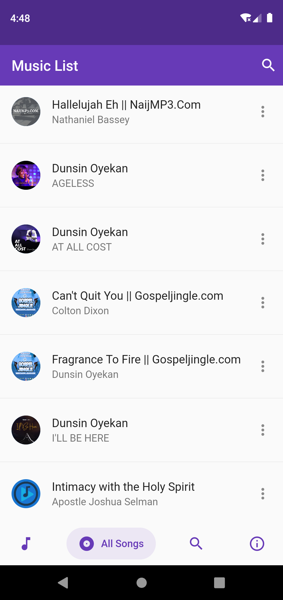

# Music Player with flutter

This application is simple music player using Flutter audio manager.

## Functionalities
- Read all audio files from device
- Auto sort Audio
- playing Audio files
- audio modes like [shuffle], [repeat] etc
- Background mode with Notification control.

## Packages used:
- Flutter Audio query
- Salmon bottom Bar
- flutter Audio manager

## screenshots
all music

